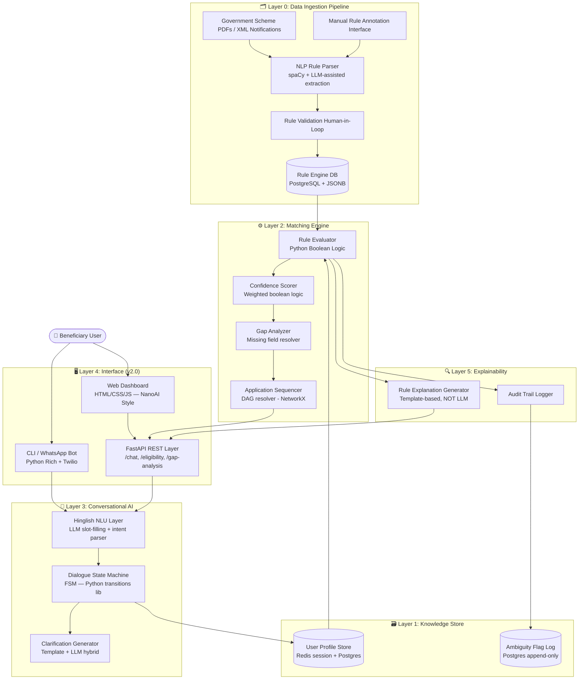

# MISSION 03 KALAM — File 1: Backend & Architecture
**Team:** antigravity | **Classification:** Technical Architecture Document v2.0 (Updated with Full Implementation)

---

## Table of Contents
1. [System Architecture Diagram](#1-system-architecture-diagram)
2. [Technical Decisions](#2-technical-decisions)
3. [Structured Eligibility Rules — 15 Schemes](#3-structured-eligibility-rules--15-schemes)
4. [The Ambiguity Map](#4-the-ambiguity-map)
5. [Matching Engine Logic](#5-matching-engine-logic)
6. [**[NEW] Full Backend Implementation (FastAPI)**](#6-full-backend-implementation)
7. [**[NEW] Frontend Architecture (NanoAI-Style Dashboard)**](#7-frontend-architecture)
8. [**[NEW] API Reference**](#8-api-reference)

---

## 1. System Architecture Diagram



### Architecture Notes

| Layer | Technology Choice | Rationale |
|---|---|---|
| Rule Storage | PostgreSQL + JSONB | Rules are structured but nested; JSONB allows schema evolution without migrations |
| Session State | Redis (TTL 30 min) / In-memory (dev) | Conversation state is ephemeral; fast read/write |
| Rule Evaluation | Pure Python logic (Boolean) | Fully auditable; no black-box inference |
| Explainability | Template-based renderer | LLM explanations are non-deterministic; templates guarantee consistent legalese |
| NLU | LLM (Claude Sonnet) + Rule-based fallback | Hinglish parsing is infeasible with rule-based NLP alone |
| REST API | FastAPI (Python) | Async, OpenAPI auto-docs, Pydantic validation |
| Web UI | Pure HTML/CSS/JS (NanoAI-style) | Zero framework dependencies for field deployment |

---

## 2. Technical Decisions

### Decision 1: Pure Logic Rules Engine vs. ML Classifier

**Decision Made:** Use a **deterministic, Boolean rules engine** (Python-native) for eligibility determination.

**Rejected Alternatives:**

| Alternative | Why Rejected |
|---|---|
| ML classifier (XGBoost / fine-tuned LLM) | Cannot produce legally defensible eligibility decisions. If model says "yes" and government says "no," we have no audit trail. Confidence intervals are statistical, not rule-based. |
| Prolog / Datalog | High learning curve for team; poor ecosystem for web deployment; JSON interop is painful. |
| CLIPS (NASA rule engine) | Legacy C tooling; no Python-native bindings; deployment on modern cloud infra is complex. |

**Rationale for Choice:**
Every eligibility decision **must be traceable to a specific gazette notification clause**. A pure logic engine means: `confidence = 1.0` iff all conditions are True, `confidence = partial` iff some conditions are indeterminate (missing data), and `confidence = 0.0` iff any hard-exclusion condition is True.

---

### Decision 2: PostgreSQL (Relational) vs. Neo4j (Knowledge Graph) for Scheme Data

**Decision Made:** Use **PostgreSQL with JSONB** for scheme rules and a **lightweight NetworkX DAG** in-memory for application sequencing.

**Rejected Alternatives:**

| Alternative | Why Rejected |
|---|---|
| Neo4j Knowledge Graph | Overkill for 15 schemes. Graph queries (Cypher) add operational complexity. |
| MongoDB | No ACID guarantees; joins become application-level complexity. |
| Pure flat JSON files | No concurrent writes; no query capability. |

---

### Decision 3: Embedding Strategy for Unstructured Gazette Text

**Decision Made:** LLM-assisted **structured extraction** (one-time ETL pipeline) → discard LLM at runtime.

**Rejected Alternatives:**

| Alternative | Why Rejected |
|---|---|
| RAG at runtime | LLM may hallucinate eligibility criteria. Catastrophic failure mode for welfare systems. |
| Sentence embeddings + cosine similarity | Too fuzzy for binary eligibility. Income thresholds must match exactly, not approximately. |

---

### Decision 4 [NEW]: FastAPI vs. Django/Flask for REST Layer

**Decision Made:** Use **FastAPI** with Pydantic models.

| Alternative | Why Rejected |
|---|---|
| Django REST Framework | Too heavyweight; ORM overhead not needed for session-based conversation state |
| Flask | No native async; no built-in Pydantic validation; OpenAPI docs need extra setup |
| Express (Node.js) | Python rule engine integration would require subprocess or separate service |

**Rationale:** FastAPI gives async endpoints (critical for LLM NLU calls), automatic OpenAPI docs, and Pydantic validation for all data models — all in a minimal footprint.

---

### Decision 5 [NEW]: Pure HTML/CSS/JS vs. React for Web UI

**Decision Made:** Use **pure HTML/CSS/JS** with no framework dependencies.

**Rationale:** The web UI must be deployable on:
- Field laptops with no NPM toolchain
- CSC (Common Service Centre) machines with restricted internet
- Low-bandwidth environments (WhatsApp bot fallback)

A single `index.html` file can be served from any static host or even opened directly from a USB drive. React would require a build step and CDN availability.

---

## 3. Structured Eligibility Rules — 15 Schemes

### JSON Schema Definition

```json
{
  "$schema": "http://json-schema.org/draft-07/schema#",
  "title": "SchemeEligibilityRule",
  "type": "object",
  "required": ["scheme_id", "scheme_name", "ministry", "hard_conditions", "soft_conditions",
               "exclusions", "required_docs", "prerequisites", "benefit_type"],
  "properties": {
    "scheme_id":      { "type": "string" },
    "scheme_name":    { "type": "string" },
    "ministry":       { "type": "string" },
    "benefit_summary":{ "type": "string", "description": "[NEW] Human-readable benefit description" },
    "hard_conditions": {
      "type": "array",
      "description": "ALL must be True. Failure = disqualified.",
      "items": { "$ref": "#/definitions/Condition" }
    },
    "soft_conditions": {
      "type": "array",
      "description": "Partial match reduces confidence score. Not disqualifying.",
      "items": { "$ref": "#/definitions/Condition" }
    },
    "exclusions": {
      "type": "array",
      "description": "ANY True = immediate disqualification.",
      "items": { "$ref": "#/definitions/Condition" }
    },
    "required_docs":  { "type": "array", "items": { "type": "string" } },
    "prerequisites": {
      "type": "array",
      "description": "scheme_ids that must be obtained/enrolled before applying.",
      "items": { "type": "string" }
    },
    "benefit_type":  { "type": "string", "enum": ["cash_transfer","housing","insurance","employment","food_subsidy","pension","loan"] },
    "next_action":   { "type": "string", "description": "[NEW] First actionable step for the user" },
    "state_variants":{
      "type": "object",
      "description": "State-code keyed overrides for state-specific modifications."
    },
    "ambiguity_flags":{
      "type": "array",
      "description": "Known ambiguities in this rule. Used by Ambiguity Map.",
      "items": { "type": "string" }
    }
  },
  "definitions": {
    "Condition": {
      "type": "object",
      "properties": {
        "field":    { "type": "string" },
        "op":       { "type": "string", "enum": ["eq","neq","lt","lte","gt","gte","in","not_in","is_null","is_not_null","contains"] },
        "value":    {},
        "source_clause": { "type": "string", "description": "Gazette notification reference" }
      }
    }
  }
}
```

### All 15 Scheme Rules (Summary Table)

| ID | Scheme | Benefit | Key Hard Conditions | Key Exclusions | Ambiguity Flags |
|---|---|---|---|---|---|
| S01 | PM-KISAN | ₹6,000/yr | Farmer + land owner + bank+Aadhaar | Income tax payer, govt employee, professional | A01, A03 |
| S02 | MGNREGA | 100 days work | Rural + age≥18 | Urban residence | A02 |
| S03 | Ayushman PMJAY | ₹5L insurance | SECC 2011 listed | CGHS/ESIC enrolled | A04, A05 |
| S04 | PMAY-G | Housing subsidy | Rural + kaccha/houseless + SECC listed | Prior govt housing | A04 |
| S05 | PMAY-U | Urban housing | Urban + income≤₹18L + no pucca | Prior govt housing | A06, A07 |
| S06 | PDS/NFSA | Subsidised ration | State NFSA listed (PHH/AAY) | Income tax payer, govt employee | A07, A08 |
| S07 | IGNOAPS | Old Age Pension | Age≥60 + BPL | Existing pension | A09 |
| S08 | IGNWPS | Widow Pension | Female + widow + age 40-79 + BPL | **Remarried**, existing pension | **A10** |
| S09 | IGNDPS | Disability Pension | Disability≥80% + age 18-79 + BPL | Existing pension | — |
| S10 | PMSBY | ₹2L accident cover | Age 18-70 + bank account | — | — |
| S11 | PMJJBY | ₹2L life cover | Age 18-50 + bank account | — | — |
| S12 | APY | Pension ₹1-5K/mo | Age 18-40 + bank account | Income tax payer | — |
| S13 | PMJDY | Zero-balance account | No existing bank + Aadhaar | — | — |
| S14 | SSY | Girl child savings | Girl child age 0-10 | — | — |
| S15 | PMKVY | Free skill training | Age 15-45 | — | — |

---

## 4. The Ambiguity Map

| Flag ID | Description | Affected Schemes | System Behavior |
|---|---|---|---|
| A01_LESSEE_FARMER | Central PM-KISAN rules require land ownership. Lessees cultivating land without 7/12 record → status ambiguous | S01 | Output AMBIGUOUS (0.40), escalate to agriculture dept |
| A02_JOBCARD_HOUSEHOLD | MGNREGA job card is household unit, but individuals apply. Multiple adults in household create ambiguity about benefit split | S02 | Flag, collect family_size, note household basis |
| A03_LAND_RECORD_DIGITIZATION | Many states have incomplete Bhu-Aadhar / land digitization. PM-KISAN portal may reject valid records | S01 | Flag, advise CSC-assisted enrollment |
| A04_SECC_DATA_STALENESS | SECC 2011 is 13+ years old. Families who have become poorer since 2011 may not be listed; better-off families may still be listed | S03, S04 | Cannot override; direct to 14555 helpline |
| A05_STATE_EXPANSION | Some states expanded PMJAY to non-SECC families via state funds (Mukhyamantri Swasthya Bima) | S03 | Add state_variants; note state scheme separately |
| A06_URBAN_RURAL_BOUNDARY | Census Towns are administratively urban but may have rural characteristics; MGNREGA/PMAY-G boundary disputed | S02, S04, S05 | Output dual analysis with disclaimer |
| A07_FAMILY_DEFINITION | "Family" is inconsistently defined: NFSA uses household unit; PMAY-U uses "not owning pucca house anywhere in India" (includes extended family) | S05, S06 | Flag, ask family_composition follow-up |
| A08_STATE_QUOTA_VARIATION | PDS quota allocation varies by state; some states have exhausted NFSA quota → eligible beneficiaries not on list | S06 | Cannot confirm; direct to state food dept portal |
| A09_BPL_LIST_VERSION | Multiple BPL list versions in use: 1997, 2002, SECC 2011. Different schemes reference different lists | S07, S08, S09 | Ask which BPL card/year; note scheme-specific list requirement |
| **A10_WIDOW_REMARRIAGE** | **IGNWPS says "widow" — remarriage terminates eligibility per NSAP 2016 Para 4.3. BUT state records often not updated. System must detect and flag.** | **S08** | **Hard exclusion if remarried disclosed. Never advise hiding remarriage.** |
| A11_DISABILITY_CERTIFICATE | Disability certificates pre-UDID era may not be accepted. Old SADM format vs new UDID card creates enrollment friction | S09 | Flag old certificate; advise UDID registration at swavlambancard.gov.in |
| A12_AADHAAR_NO_BANK | Aadhaar without bank means DBT-dependent schemes are BLOCKED (not ineligible). Critical distinction. | S01, S02, S04 | Output BLOCKED status + PMJDY as mandatory prerequisite |

---

## 5. Matching Engine Logic

### 5.1 Core Evaluator

```python
from typing import Optional, Any
from enum import Enum
from dataclasses import dataclass, field

class MatchStatus(str, Enum):
    QUALIFIED             = "QUALIFIED"
    LIKELY_QUALIFIED      = "LIKELY_QUALIFIED"
    REQUIRES_VERIFICATION = "REQUIRES_VERIFICATION"
    AMBIGUOUS             = "AMBIGUOUS"
    INELIGIBLE            = "INELIGIBLE"
    BLOCKED               = "BLOCKED"

def eval_condition(cond: dict, flat: dict) -> Optional[bool]:
    """
    Evaluates a single condition against the flat user profile.
    Returns:
        True  — condition met
        False — condition failed (disqualifying for hard conditions)
        None  — data missing (indeterminate)
    """
    field   = cond["field"]
    op      = cond["op"]
    val     = cond.get("value")
    user_val = flat.get(field)

    if user_val is None:
        return None  # Cannot determine — flag as missing

    try:
        if op == "eq":     return user_val == val
        if op == "neq":    return user_val != val
        if op == "lt":     return float(user_val) < float(val)
        if op == "lte":    return float(user_val) <= float(val)
        if op == "gt":     return float(user_val) > float(val)
        if op == "gte":    return float(user_val) >= float(val)
        if op == "in":     return user_val in val
        if op == "not_in": return user_val not in val
    except (TypeError, ValueError):
        return None
    return None

def match_scheme(scheme: dict, profile: "UserProfile") -> "SchemeMatchResult":
    flat = profile.to_flat_dict()
    missing_fields = []
    failed_hard = []
    triggered_excl = []
    audit_trail = []

    # PHASE 1: Exclusions — ANY True = INELIGIBLE
    for cond in scheme.get("exclusions", []):
        result = eval_condition(cond, flat)
        audit_trail.append({"phase": "exclusion", "field": cond["field"], "result": str(result)})
        if result is True:
            triggered_excl.append(cond["field"])
            return SchemeMatchResult(
                scheme_id=scheme["scheme_id"],
                scheme_name=scheme["scheme_name"],
                status=MatchStatus.INELIGIBLE,
                confidence_score=0.0,
                confidence_breakdown={"exclusion_triggered": cond["field"]},
                missing_fields=[],
                failed_hard_conditions=[],
                triggered_exclusions=triggered_excl,
                ambiguity_flags=scheme.get("ambiguity_flags", []),
                application_sequence=[],
                explanation=f"❌ Ineligible: {cond['field']} exclusion triggered.",
                benefit_summary=scheme.get("benefit_summary",""),
                required_docs=scheme.get("required_docs",[]),
                next_action="Aap is scheme ke liye eligible nahi hain.",
            )

    # PHASE 2: Hard Conditions — ALL must be True
    hard_scores = []
    for cond in scheme.get("hard_conditions", []):
        result = eval_condition(cond, flat)
        audit_trail.append({"phase": "hard", "field": cond["field"], "result": str(result)})
        if result is None:
            missing_fields.append(cond["field"])
            hard_scores.append(0.5)      # Partial — missing data
        elif result is True:
            hard_scores.append(1.0)
        else:
            failed_hard.append(cond["field"])
            hard_scores.append(0.0)

    hard_avg = sum(hard_scores) / max(len(hard_scores), 1)

    # PHASE 3: Soft Conditions — bonus confidence
    soft_scores = []
    SOFT_WEIGHT = 0.15
    for cond in scheme.get("soft_conditions", []):
        result = eval_condition(cond, flat)
        soft_scores.append(1.0 if result is True else 0.0)

    soft_bonus      = (sum(soft_scores)/max(len(soft_scores),1)) * SOFT_WEIGHT if soft_scores else 0
    missing_penalty = len(missing_fields) * 0.10
    ambiguity_flags = scheme.get("ambiguity_flags", [])
    ambiguity_cap   = 0.75 if ambiguity_flags else 1.0

    # PHASE 4: Composite Score
    raw_score   = min(1.0, hard_avg + soft_bonus - missing_penalty)
    final_score = round(min(raw_score, ambiguity_cap), 2)

    # Determine Status
    if final_score >= 0.85 and not missing_fields:
        status = MatchStatus.QUALIFIED
    elif final_score >= 0.60:
        status = MatchStatus.LIKELY_QUALIFIED
    elif missing_fields and not failed_hard:
        status = MatchStatus.BLOCKED if "bank_account" in missing_fields else MatchStatus.REQUIRES_VERIFICATION
    elif ambiguity_flags:
        status = MatchStatus.AMBIGUOUS
    else:
        status = MatchStatus.REQUIRES_VERIFICATION

    return SchemeMatchResult(
        scheme_id=scheme["scheme_id"],
        scheme_name=scheme["scheme_name"],
        status=status,
        confidence_score=final_score,
        confidence_breakdown={
            "hard_avg":        round(hard_avg, 2),
            "soft_bonus":      round(soft_bonus, 2),
            "missing_penalty": round(missing_penalty, 2),
            "ambiguity_cap":   ambiguity_cap,
        },
        missing_fields=missing_fields,
        failed_hard_conditions=failed_hard,
        triggered_exclusions=[],
        ambiguity_flags=ambiguity_flags,
        application_sequence=[],
        explanation=f"Confidence: {int(final_score*100)}% | {status.value} | Missing: {missing_fields or 'None'}",
        benefit_summary=scheme.get("benefit_summary",""),
        required_docs=scheme.get("required_docs",[]),
        next_action=scheme.get("next_action",""),
    )
```

### 5.2 Gap Analysis

```python
FIELD_GUIDANCE = {
    "aadhaar":                  "Nearest Aadhaar centre ya post office mein enroll karein",
    "bank_account":             "PMJDY ke liye kisi bhi nationalized bank mein zero-balance account kholein",
    "land_record_7_12":         "Apne tehsil / patwari office se certified copy lein",
    "secc_2011_listed":         "pmjay.gov.in par apna naam check karein ya 14555 call karein",
    "bpl_certificate":          "Gram Panchayat / Ward office se BPL certificate lein",
    "disability_certificate":   "Jile ke SADM office mein jaein",
    "death_certificate_spouse": "Municipal / Gram Panchayat office se death certificate lein",
    "age_proof":                "Janm praman patra ya school certificate",
    "income_certificate":       "Tehsildar se income certificate lein",
    "job_card":                 "Gram Panchayat mein MGNREGA Job Card ke liye apply karein",
}

def gap_analysis(profile, matches):
    gaps = {}
    for result in matches:
        if result.status in [MatchStatus.REQUIRES_VERIFICATION,
                             MatchStatus.LIKELY_QUALIFIED,
                             MatchStatus.BLOCKED]:
            for field in result.missing_fields:
                if field not in gaps:
                    gaps[field] = {
                        "field": field,
                        "affects_schemes": [],
                        "priority": "low",
                        "how_to_obtain": FIELD_GUIDANCE.get(field, "Contact local CSC"),
                    }
                gaps[field]["affects_schemes"].append(result.scheme_id)
    for f, info in gaps.items():
        n = len(info["affects_schemes"])
        info["priority"] = "high" if n >= 3 else "medium" if n >= 2 else "low"
    return sorted(gaps.values(), key=lambda x: {"high":0,"medium":1,"low":2}[x["priority"]])
```

### 5.3 Explainability Contract (Invariants)

```python
def validate_explainability_contract(result) -> bool:
    """
    INVARIANTS — must hold before any result is shown to user:
    1. Zero confidence MUST have at least one exclusion or hard-fail reason
    2. Full confidence MUST have zero missing_fields and zero ambiguity_flags
    3. explanation must be non-empty
    4. Every missing_field must have a corresponding FIELD_GUIDANCE entry
    5. audit_trail length == sum(hard_conditions + exclusions + soft_conditions) checked
    """
    assert not (result.confidence_score == 0.0 and
                not result.failed_hard_conditions and
                not result.triggered_exclusions), \
        "EXPLAINABILITY VIOLATION: Zero confidence with no reason"

    assert not (result.confidence_score == 1.0 and
                (result.missing_fields or result.ambiguity_flags)), \
        "EXPLAINABILITY VIOLATION: Full confidence despite gaps"

    assert result.explanation, "EXPLAINABILITY VIOLATION: Empty explanation"

    for field in result.missing_fields:
        assert field in FIELD_GUIDANCE, \
            f"EXPLAINABILITY VIOLATION: No guidance for '{field}'"

    return True
```

---

## 6. Full Backend Implementation

### 6.1 File: `kalam_backend/app.py`

> **Status:** Complete implementation — see `/kalam_backend/app.py`

#### Key Endpoints

| Method | Endpoint | Description |
|---|---|---|
| `POST` | `/chat` | Main conversational endpoint — NLU + profile update + matching + reply |
| `POST` | `/eligibility` | Run full eligibility check for a session |
| `GET`  | `/gap-analysis/{session_id}` | Get prioritized gap analysis |
| `GET`  | `/session/{session_id}` | Get full session profile |
| `DELETE` | `/session/{session_id}` | Clear session |
| `GET`  | `/schemes` | List all 15 schemes |
| `GET`  | `/health` | Health check + LLM availability |

#### Data Flow per `/chat` Request

```
POST /chat { session_id, message, channel }
         │
         ▼
   Load session (Redis / in-memory)
         │
         ▼
   NLU Slot Extractor (Claude Sonnet → rule-based fallback)
         │
         ▼
   apply_nlu_to_profile() — updates ProfileField objects
         │
         ├── Contradiction detection (auto-log, no auto-update)
         │
         ▼
   run_all_matches() — deterministic Boolean evaluator for all 15 schemes
         │
         ▼
   gap_analysis() — priority-sorted missing fields
         │
         ▼
   generate_reply() — template-based, no LLM at this stage
         │
         ▼
   Save session
         │
         ▼
   ChatResponse { reply, profile_snapshot, scheme_matches, gap_analysis }
```

### 6.2 Environment Setup

```bash
# Create virtual environment
python -m venv .venv
source .venv/bin/activate  # Windows: .venv\Scripts\activate

# Install dependencies
pip install fastapi uvicorn pydantic anthropic redis networkx

# Set environment variables
export ANTHROPIC_API_KEY="YOUR_ANTHROPIC_API_KEY"   # Optional — rule-based fallback used if absent
export REDIS_URL="redis://localhost:6379" # Optional — in-memory used if absent

# Run server
uvicorn app:app --reload --port 8000

# API Docs (auto-generated)
# Open: http://localhost:8000/docs
```

### 6.3 NLU System Prompt (Production)

```python
NLU_SYSTEM_PROMPT = """
You are an NLU slot-extractor for a Hindi/Hinglish government welfare chatbot called KALAM.
Extract structured profile fields from user utterances. Respond ONLY with valid JSON.

Schema: {
  "extracted_fields": {
    "state": null, "residence_type": null, "age": null, "gender": null,
    "occupation": null, "annual_income": null, "marital_status": null,
    "remarried": null, "aadhaar": null, "bank_account": null,
    "bpl_category": null, "secc_2011_listed": null, "disability": null,
    "disability_percentage": null, "housing_status": null,
    "land_ownership_status": null, "income_tax_payer": null
  },
  "confidence": {},      // per-field, 0.0–1.0
  "intent": "",          // provide_info | ask_scheme | ask_eligibility | ask_documents | grievance | goodbye
  "follow_up_question": ""  // Next question in Hinglish
}
"""
```

---

## 7. Frontend Architecture

### 7.1 Design System — NanoAI Style Dashboard

> **Status:** Complete — see `/kalam_frontend/index.html`

The frontend is modelled after the **NanoAI dashboard** design pattern:
- **Left sidebar** (240px, dark `#0f0f1a`) with navigation, scheme count badge, and download buttons
- **Top bar** with search, `+ New Session` button, notification and language icons, and user avatar
- **Main content area** with soft blue/lavender gradient (`linear-gradient(135deg, #dde1f9, #eef0f9, #d6f5ef)`)
- **Animated 3D orb** centerpiece using conic-gradient + hue-rotate animation
- **Tab bar** for Chat / Schemes / Gap / Profile / Track / Guide
- **Bottom schemes grid** — all 15 schemes displayed as cards with status badges

### 7.2 Color System

```css
:root {
  --sidebar-bg:      #0f0f1a;        /* Dark near-black sidebar */
  --sidebar-active:  #6c63ff;        /* Purple accent for active nav */
  --main-bg:         #eef0f9;        /* Soft lavender main background */
  --accent-blue:     #6c63ff;        /* Primary action color */
  --accent-teal:     #00d4aa;        /* Secondary — confidence high */
  --accent-orange:   #ff6b35;        /* Warning — medium confidence */
  --accent-pink:     #ff4dab;        /* Alert — ineligible */
  --gradient-hero:   linear-gradient(135deg, #dde1f9 0%, #eef0f9 40%, #d6f5ef 100%);
  --gradient-accent: linear-gradient(135deg, #6c63ff, #00d4aa);
}
```

### 7.3 Panel Architecture

| Panel ID | Trigger | Contents |
|---|---|---|
| `panel-chat` | Default / Chat tab | Hero orb, category tabs, chat window, quick action pills, stat cards, mini schemes grid |
| `panel-schemes` | Schemes tab / nav | Full 15-scheme list with confidence bars and status badges |
| `panel-gap` | Gap tab / nav | Priority-sorted gap analysis with field, action, affected schemes |
| `panel-profile` | Profile tab / nav | All ProfileField values with completion checkmarks |
| `panel-track` | Track tab / nav | Application sequence (populated after profile completion) |
| `panel-guide` | Guide tab | 4-step usage guide for new users |

### 7.4 Chat State Machine (Frontend)

```javascript
// Profile fields tracked client-side
let profile = {};
let turns   = 0;

// Field collection priority (mirrors backend FIELD_PRIORITY_ORDER)
const fieldOrder = ['state','residence_type','age','occupation','annual_income','gender'];

// Confidence scoring displayed live
function getBotResponse(userMsg) {
    // 1. Parse known fields from message (regex + keyword)
    // 2. Update profile object
    // 3. Update stat cards (matched count, profile %, missing docs, turns)
    // 4. Return appropriate response (scheme results | next question | gap action)
}
```

### 7.5 Deployment Options

| Environment | Method | Notes |
|---|---|---|
| Field laptop (no internet) | Open `index.html` directly in browser | Zero dependencies; full UI works offline |
| CSC operator station | Serve via `python -m http.server 8080` | Backend on localhost:8000 |
| Production web | Nginx + uvicorn | `proxy_pass http://localhost:8000` for API |
| WhatsApp | Twilio webhook → FastAPI `/chat` endpoint | Same backend, different UI layer |

---

## 8. API Reference

### POST `/chat`

**Request:**
```json
{
  "session_id": "abc123",       // null = create new session
  "message": "Main Rajasthan se hoon, kisan hoon",
  "channel": "web"              // web | whatsapp | cli
}
```

**Response:**
```json
{
  "session_id": "abc123",
  "reply": "✓ Rajasthan. Gaon mein rehte hain ya shahar mein?",
  "profile_snapshot": { "state": "Rajasthan", "occupation": "farmer", ... },
  "scheme_matches": [
    {
      "scheme_id": "S01",
      "scheme_name": "PM-KISAN",
      "status": "REQUIRES_VERIFICATION",
      "confidence_score": 0.55,
      "missing_fields": ["land_ownership_status", "bank_account"],
      "explanation": "Confidence: 55% | Land record and bank account needed",
      "next_action": "PM-KISAN portal ya CSC mein register karein",
      "required_docs": ["aadhaar", "land_record_7_12", "bank_passbook"]
    }
  ],
  "gap_analysis": [
    {
      "field": "bank_account",
      "priority": "high",
      "affects_schemes": ["S01","S02","S10"],
      "how_to_obtain": "PMJDY ke liye kisi bhi nationalized bank mein zero-balance account kholein"
    }
  ],
  "turn_count": 1,
  "profile_completion_pct": 22
}
```

---

*End of File 1 — Backend & Architecture (v2.0 with Full Implementation)*
*Next: `2_frontend_and_conversational_ui.md`*